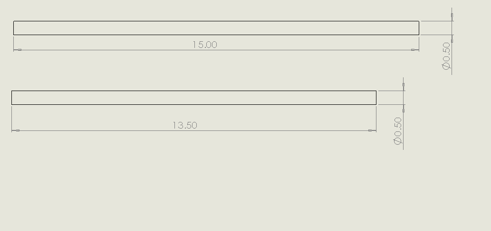
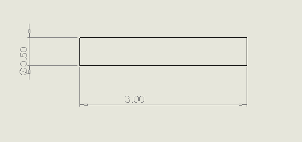
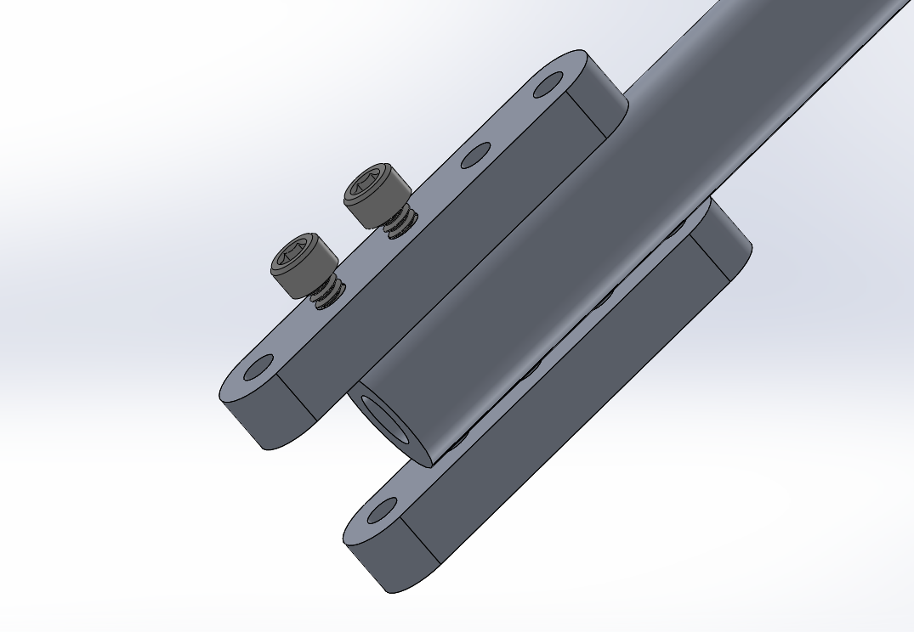
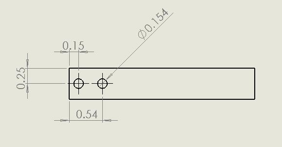
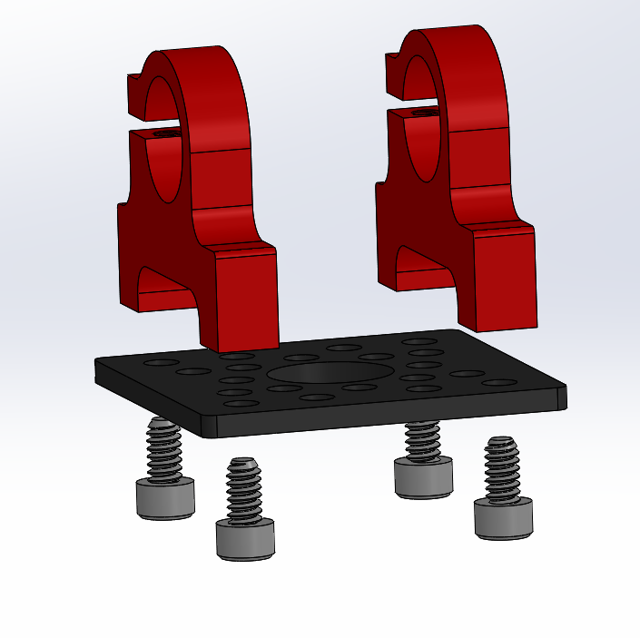
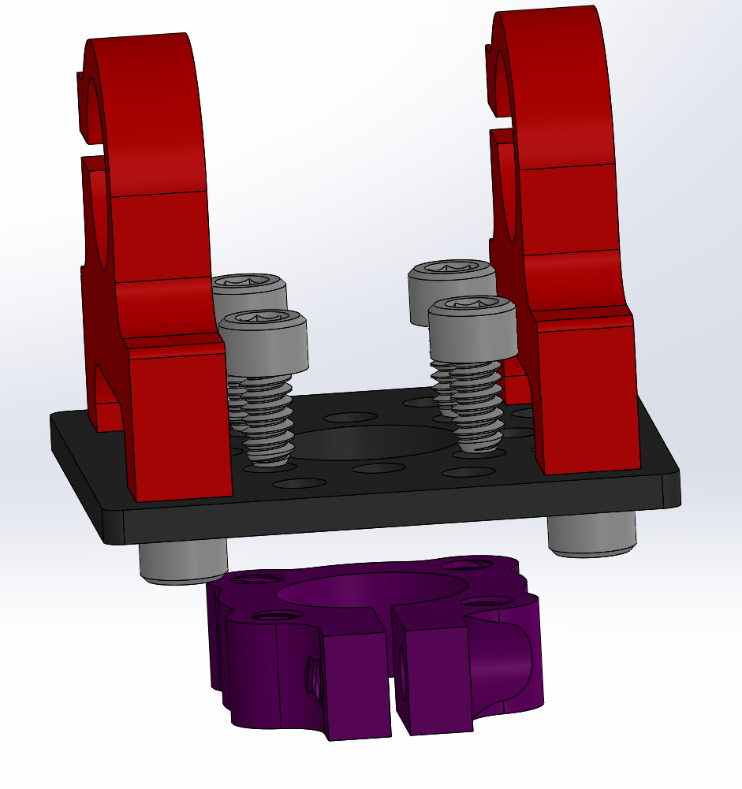
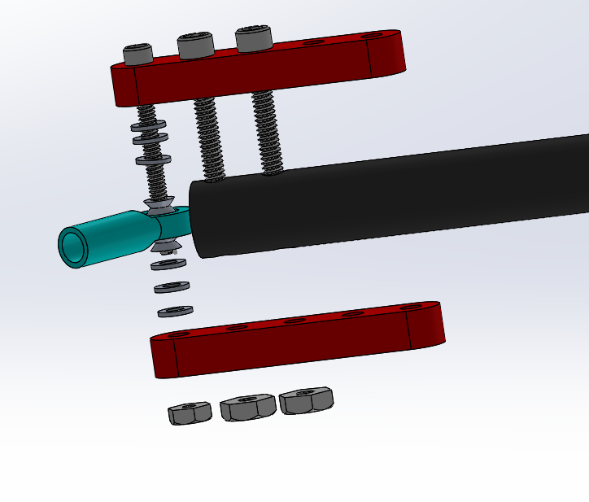
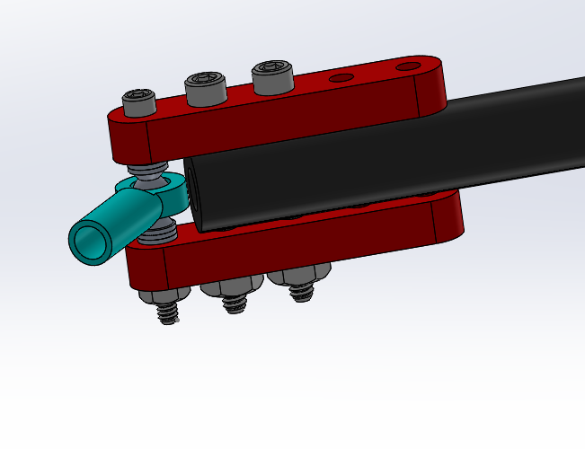
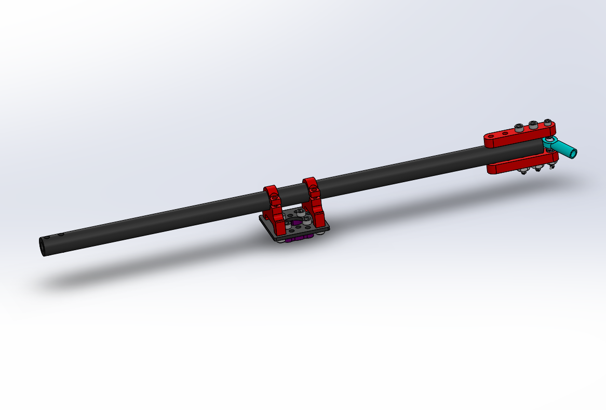
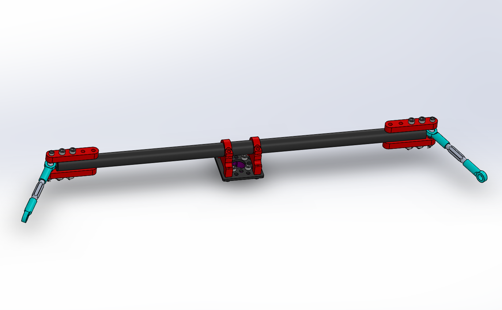

# Differential Pivot
The Differential Pivot helps to offload forces from one side of the rover to the other while climbing. The differential pivot is crucial in the rocker-bogie suspension system and is designed to help keep all 6 wheels on the ground at all times. It also allows a second attachment point for the body so that it does not free rotate about the center bar that runs through it and connects the two sides of the rocker-bogie.

 

## Features
  * Uses inexpensive RC turnbuckles to give multi-degree rotation about 2 separate points, allowing the geometry to be greatly simplified

## Mechanical Interface/Attachments to Rover:
  * 1/2 inch clamping hub to 1/2 inch aluminum rod on the body
  * 1/2 inch aluminum rod to 1/2 inch clamping hub on rocker-bogie arms

## Machining/Fabrication

1. Aluminum Rods: Cutting

    Parts/Tools Necessary

    | Item | Ref | Qty | Image |
    | :--- | :-- | :-- | :---: |
    | 0.5" x 3' Aluminum Tube | S16 | 1 |  |
    | 0.5" x 4" Aluminum Tube | S18 | 4 |  |
    | Metal Hacksaw or Bandsaw | D4 | 1  |  |
    | Vice clamp or C clamps | D5 | 1 |  |

    1. Take the 3 foot piece of 0.5 inch aluminum rod S16 and cut it into one 15 inch piece and one 13.5 inch piece. These will now be referred to as the parts S16A and S16B respectively. In addition, take two of the 4 inch aluminum rods S18 and cut them down to 3 inches in length as well.

    |  | |
    |:-:|:-:|
    | Figure 1| Figure 2 |

2. Aluminum Rods: Drilling
    Parts/Tools Necessary
    | Item | Ref | Qty | Image |
    | :--- | :-- | :-- | :---: |
    | 0.5" x 13.5" Aluminum Tube (Modified) | S16B | 1 | |
    | 0.5" x 3" Aluminum Tube (Modified) | S18A | 2 | |
    | Hand Drill or drill press | D3 | 1 ||
    | Drill bit #23 | D6 | 1 | |
    | Center punch or start drill bit | D7 | 1 | |
    | Vice or V-clamp | D8 | 1 |  | 

    The turnbuckles must be attached to the differential pivot and rocker-bogie arm. We will accomplish this by drilling holes in the aluminum beam S16B and attaching two 5-hole aluminum bars on each side.
    1. Using a vice or clamp, firmly grab onto the 0.5 x 13.5 inch rod S16B with the end extending out around 2 inches from the edge of the vice/clamp. Mark the dimensions as shown in Figure 3. Carefully use a center drill to start the a center hole for these holes. It is important that the center hole is as centered as possible to prevent the bit from walk- ing/slipping during drilling, which could result in the bit breaking. Then, use a #23 (0.154 inch diameter) drill bit and drill all the way through both sides of the rod. This makes the S16B’ part.

    |  |
    | :--: |
    | Figure 3 |

    2. Test the holes by taking the 5 Hole Aluminum Beams S21 and screws B7 and making sure that the screws go all the way through as shown in Figure 4. If they do not fit, you can Figure 3: Testing the differential pivot holes Flip the rod around and repeat the steps for the other side, making sure to align the holes’ axes as much as possible such that the holes are all parallel to the previous set.

    |  |
    | :--: |
    | Figure 4 |

    3. Next, take two of the 0.5x3 inch hollow rods S18 and create the same set of holes as before, showed again in Figure 5 (this time, drill holes on just one end of each of the rods). Test each of the sets of holes to make sure the 5-hole aluminum beams will attach to each of the rods. These will now be the part S18B

    |  |
    | :--: |
    | Figure 5 |

## Mechanical Assembly
  Parts/Tools Necessary

  | Item | Ref | Qty | Image |
  | :--- | :-- | :-- | :---: |
  | Single Pattern Bracket | S8 | 1 |  |
  | 0.5" Circular Clamping Hub | S13 | 1 | |
  | 0.5" x 13.5" Aluminum Tube (Modified) | S16B | 1 | |
  | 0.5" x 3" Aluminum Tube (Modified) | S18B | 2 | |
  | 0.5" Bottom Bore Clamp | S20 | 2 | | 
  | 5 Hole Aluminum Beam | S21 | 8 | |
  | RC Turnbluckle | S32 | 2 | | 
  | #6-32x1/4" Button Head Screw | B1 | 8 | |
  | #6-32x1.25" Button Head Screw | B7 | 8 | |
  | #4-40x1.25" Button Head Screw | B9 | 4 | |
  | #6-32 Hexnut | B11 | 8 | |
  | #4-40 Hexnut | B12 | 4 | |
  | #4-40 Washer | W2 | 24 | | 
  | Wrench Set | D1 | 1 | |
  | Allen Key Set | D2 | 1 | |

1. Build clamping hub assembly: Attach the the bottom bore clamping hubs S20 to the single pattern bracket S8 using screws B1. Then mount the 0.5” clamping hub S13 to the bottom of this assembly using B1 screws.

  |  | |
  |:-:|:-:|
  | Figure 6| Figure 7 |

2. Differential Pivot: Attach the turnbuckle S32 to the modified 13.5-inch aluminum rod S16B as shown using the 5-hole aluminum bars S21, washers W2, screws B7 and B9, hex nuts B11 and B12. The outermost screw is the #4 screw, the others are #6.

  |  | |
  |:-:|:-:|
  | Figure 8 | Figure 9 |

3. Differential Pivot continued: Pass the 13.5inch rod through the clamping hub assembly, making sure to center it as much as possible. Then repeat step 2 for the other side of the differential pivot. If necessary, unscrew the turnbuckles (by twisting the middle) to insert the rods into place, then screw the turnbuckle back together.

  |  | |
  |:-:|:-:|
  | Figure 8 | Figure 9 |

4. Differential Pivot Vertical rods: Repeat step 2 on each of the the 3 inch aluminum rods S18B. Finally, attach all the pieces of the turnbuckles together. Your differential pivot is now complete.

  |  |
  | :--: |
  | Figure 10 |

## Disclaimer

Reference herein to any specific commercial product, process, or service by trade name, trademark, manu- facturer, or otherwise, does not constitute or imply its endorsement by the United States Government or the Jet Propulsion Laboratory, California Institute of Technology. ⃝c 2018 California Institute of Technology. Government sponsorship acknowledged.
