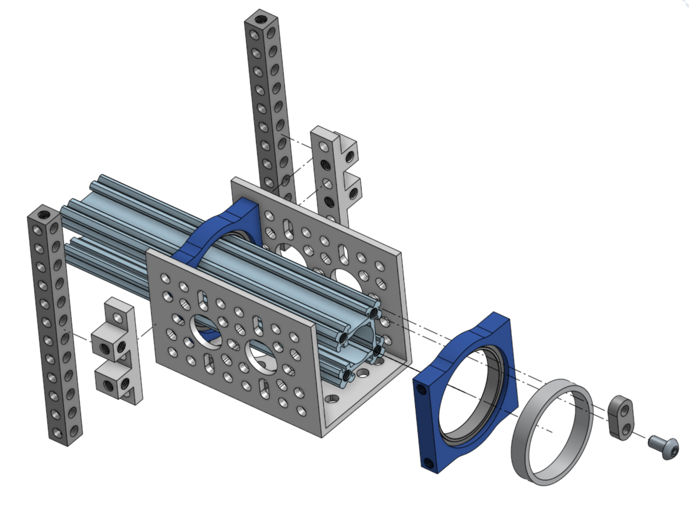
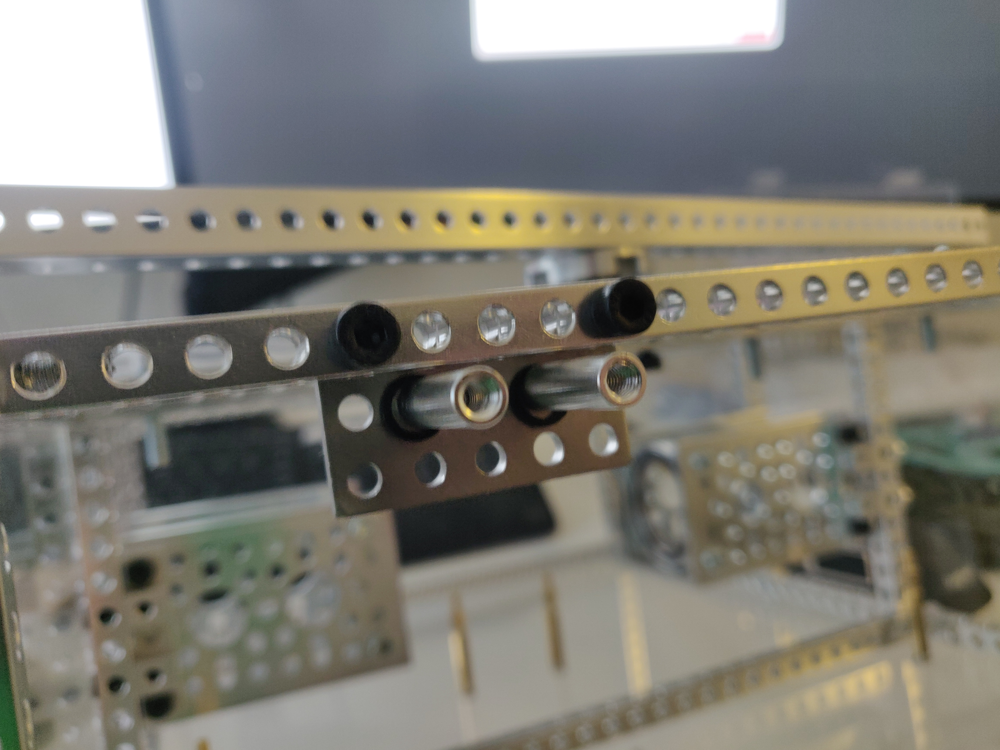
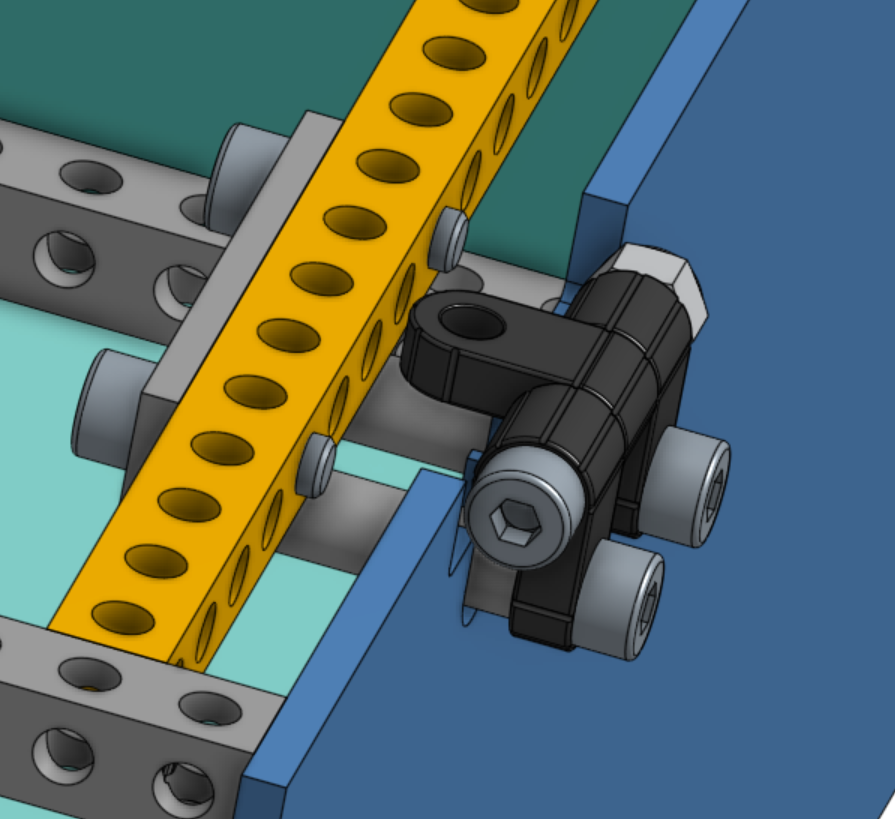

# Main Body Assembly

**Note**: documentation is a work in progress.

The body is the housing of all the electronics for the rover and acts as the attachment point for the differential pivot and the body axis that the rocker-bogies on either side connect to.

## Assemble the body frame

Gather the pieces from the [parts list for the body](../../parts_list/README.md/#parts-for-body-assembly).

Use socket M4 screws of 16mm length and pay close attention to the placement of the beams using the image below and the online OnShape model.

## Assemble the axes that connect to the rocker-bogie

|  |  |
| -------------------------------- | ----------------------------------------- |

Make two of these and connect them to the sides of the body. They should be installed exactly in the middle, which means that you're going to connect each side to the 17th hole on the long 41-hole beams on the top and bottom of the body frame. Use the M4 16mm socket screws.

The bearings have a flat side and a 'hollow' side. The hollow sides should both be pointing to the same side, as shown in the image.

## Install the hinges for the top body plates

You will need the 20 or 22mm M4 standoffs, the 3x5 hole plate, the hinge assembly (assemble following the [instructions on GoBilda](https://www.gobilda.com/plastic-hinge-2-pack/), orientation matters).

|  |  |
| -------------------------- | ---------------------- |
|      |  |

## Make the differential pivot

The Differential Pivot helps to offload forces from one side of the rover to the other while climbing. The differential pivot is crucial in the rocker-bogie suspension system and is designed to help keep all 6 wheels on the ground at all times. It also allows a second attachment point for the body so that it does not freely rotate about the center axes that run through it and connects the two rocker-bogies.

Construct the parts as in the image below, using the appropriate M4 screws where necessary. Use locking M4 hex nuts to fasten the screw passing through the turnbuckles (in blue).

Finally attach the differential pivot to the top of the body using 4 socketed M4 screws. The differential pivot should be able to freely rotate around the body. We'll attach the side of the differential pivot to the rocker-bogies later.

## Install the laser cut body plates

Use button screws because of their lower profile along with nuts on the inside so the screws don't fall out while driving. If you've completed the PCB assemblies yet, you can attach them to the bottom body plate already, but you can also do this later.
