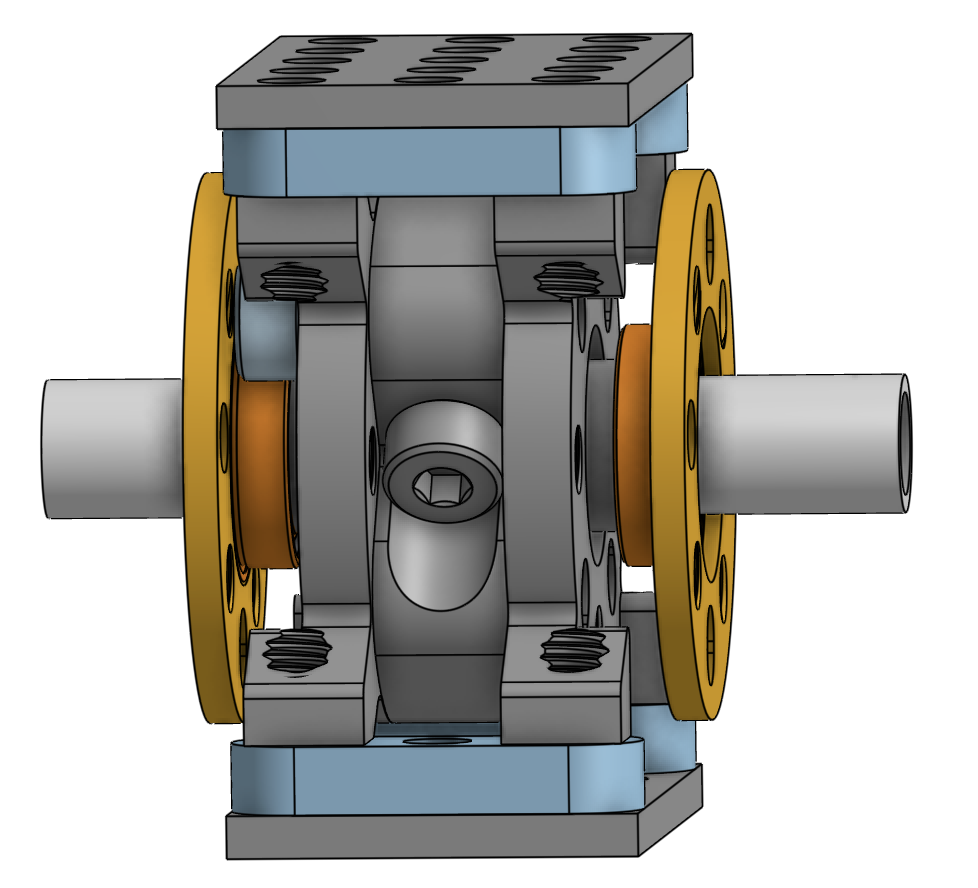

# Rocker-Bogie Suspension

**IN PROGRESS**

The Rocker-Bogie is the suspension system that enables the rover to climb aggressive obstacles. The design allows all 6 wheels to be in contact with the ground as much as possible, increasing traction.  The suspension system on a typical consumer vehicle can traverse obstacles about half the height of one wheel; the Rocker-Bogie suspension system can traverse obstacles over 2 times the height of the wheel.

## Features

* Modular link lengths give the ability to customize rover geometry
* Optimized for climbing in the forwards direction
* Rigid support structure resists lateral bending/twisting about the Bogie joint

## Mechanical Interface/Attachments to Rover

* Servo block output shafts connect to corner motor assemblies
* rocker-bogie connects to the body axis clamp via two brackets that are detailed in the [integration readme](../../integration/README.md)
* middle drive motor connects to the extruded shaft at the bottom

## Assembly

You will be creating two identical assemblies. Below instructions are for one side. We recommend building one side first rather than trying to build both sides in parallel, that way you'll be able to make the other side faster.

### Creating the rocker-bogie joint

Assemble the joint following the steps below. Since the clamp in the middle isn't symmetric and protrudes on one side, a spacer is added to the other, flat side. You can see this in the top left image.

|  |  |
| --- | --- |
|  |  |

Wait with the yellow and orange (ball bearing) parts. The bearing should first be inserted into the yellow hub.

TODO: improve images, refer to 3D model. 

### Attach the joint bearings to the servo arms

Connect the hub (yellow) with the inserted bearing to the servo arm using button M4 screws. When done, the bearing should not be able to fall out. Put these 2 assemblies aside for now.

### Attach the extruded shafts

Pay attention to direction of the slits for the cabling

### Attach the front servo

First attach the bracket to the shaft you just attached to the joint using 3 or 4 M4 screws. Then assemble the servo block to the servo. Insert the set screw that came with the servo inside the hollow shaft that fits onto the spline profile on the servo output. This prevents the corner assembly from falling off the rocker-bogie later.

Route the wiring from the servo motor through the hole and into the extruded shaft, then attach the servo motor and block to the front rocker-bogie bracket.

TODO: insert image

### Connect the servo arms and shaft to the joint

Make sure the slit in the extruded shaft faces either up or down (preference) so that you can easily route wiring through later.

Slide one of the servo arms with bearing and hub you made in an earlier step over one side of the rocker-bogie joint such that the hub faces the inside and the black servo arm faces the outside. Now take a steel bracket, two hurricane nuts, and attach the black servo arm to the extruded shaft using two M4 screws and the nuts. Tighten such that you can still slide the servo arm relative to the channel. Flip the assembly over and repeat on the other side, making sure the setup is symmetric.

### Assemble the back servo

Attach the 1-channel U bracket to the long extruded shaft using 3 or 4 M4 screws. Assemble another servo block as you did before. Insert this into the 1-channel bracket.

You have completed this subassembly when you have 2 rocker bogies, each consisting of 2 smaller assemblies.
