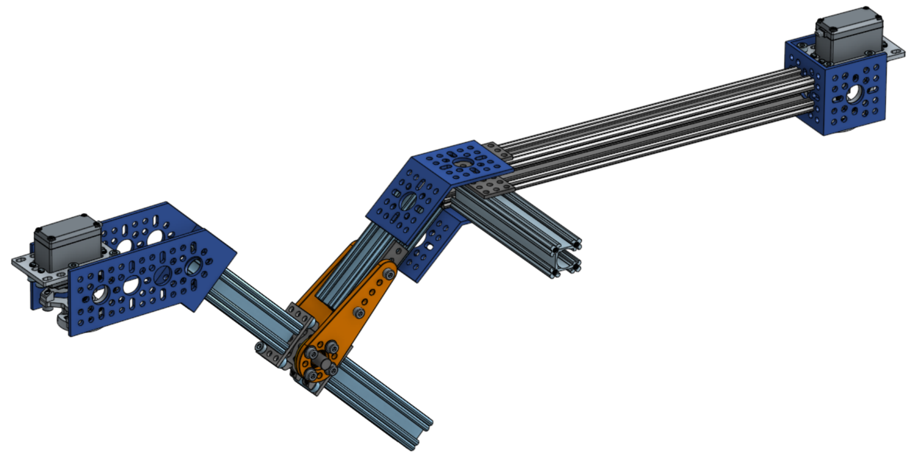
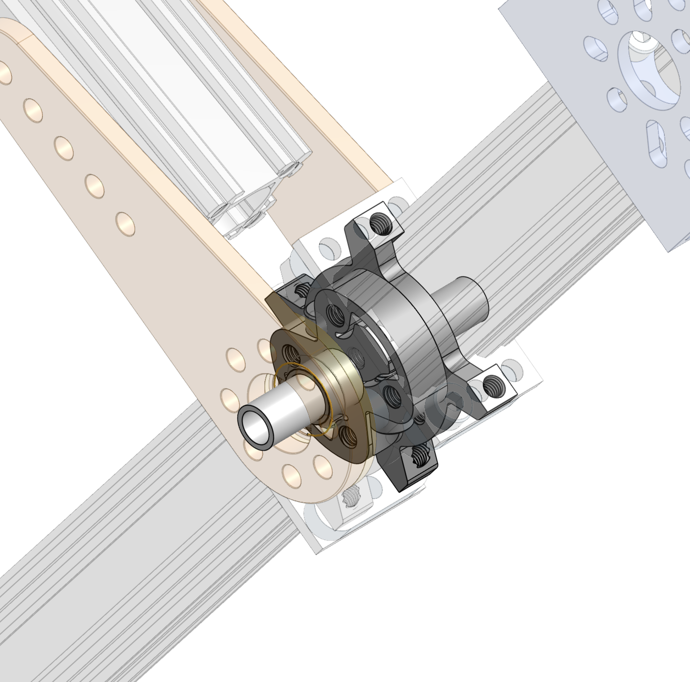
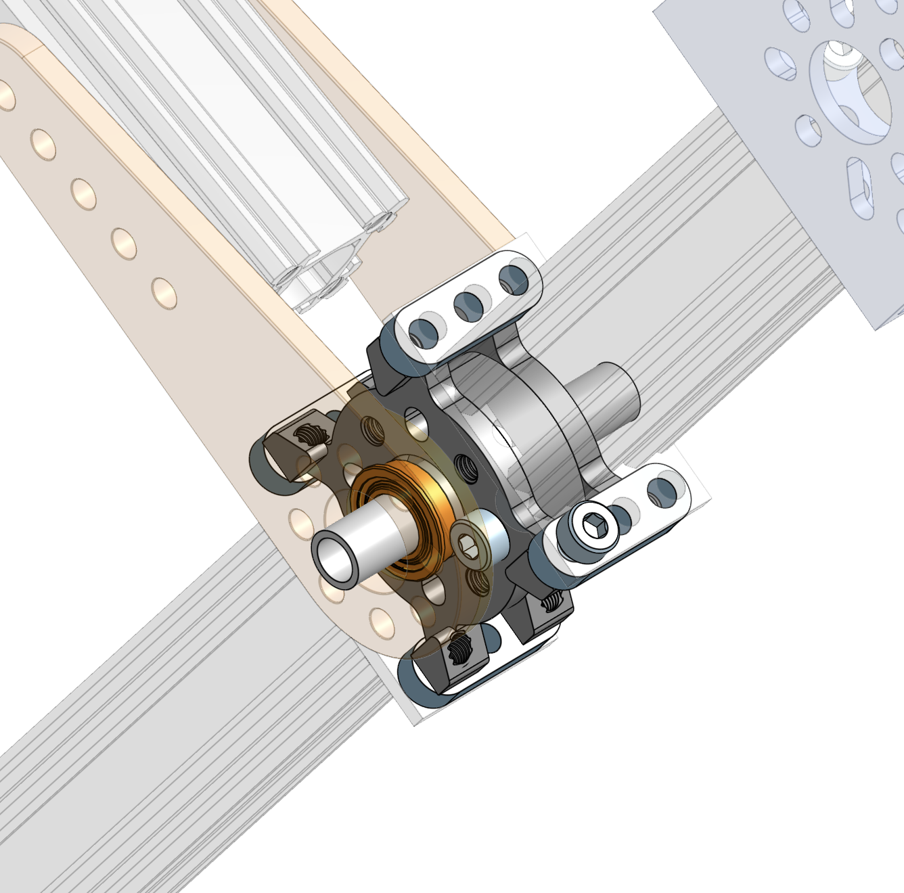
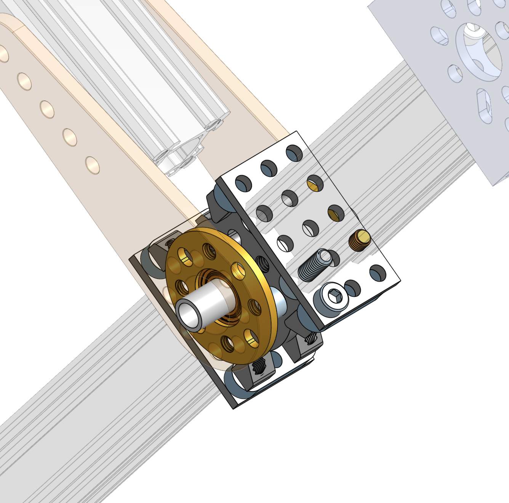
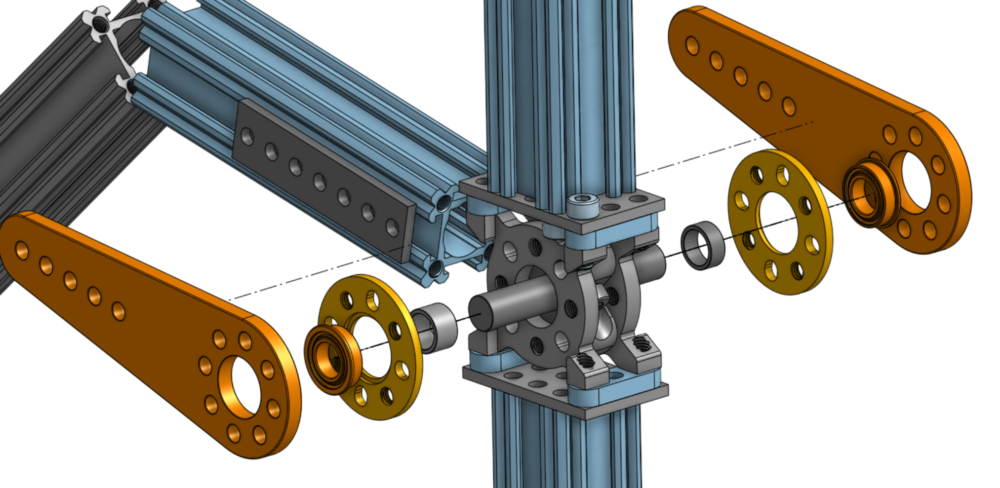
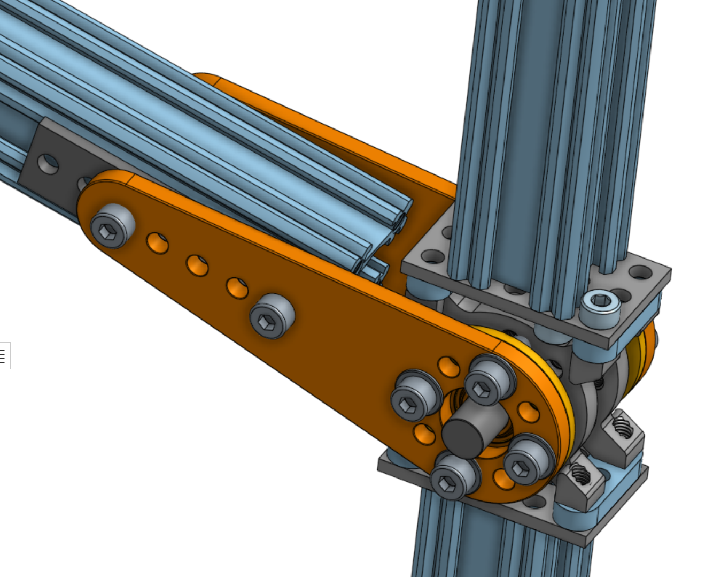
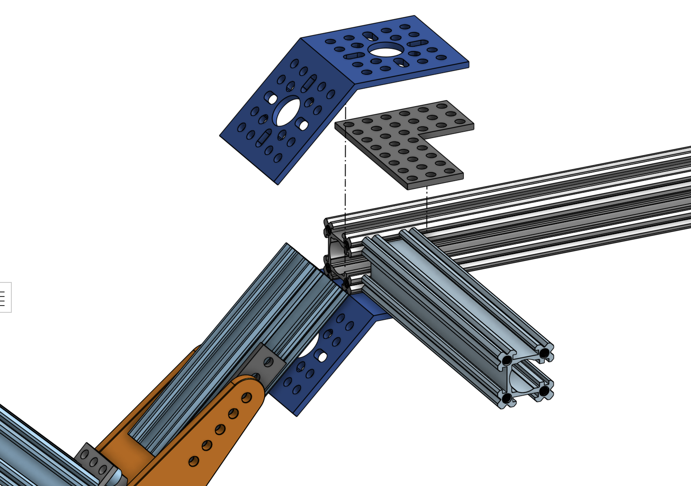
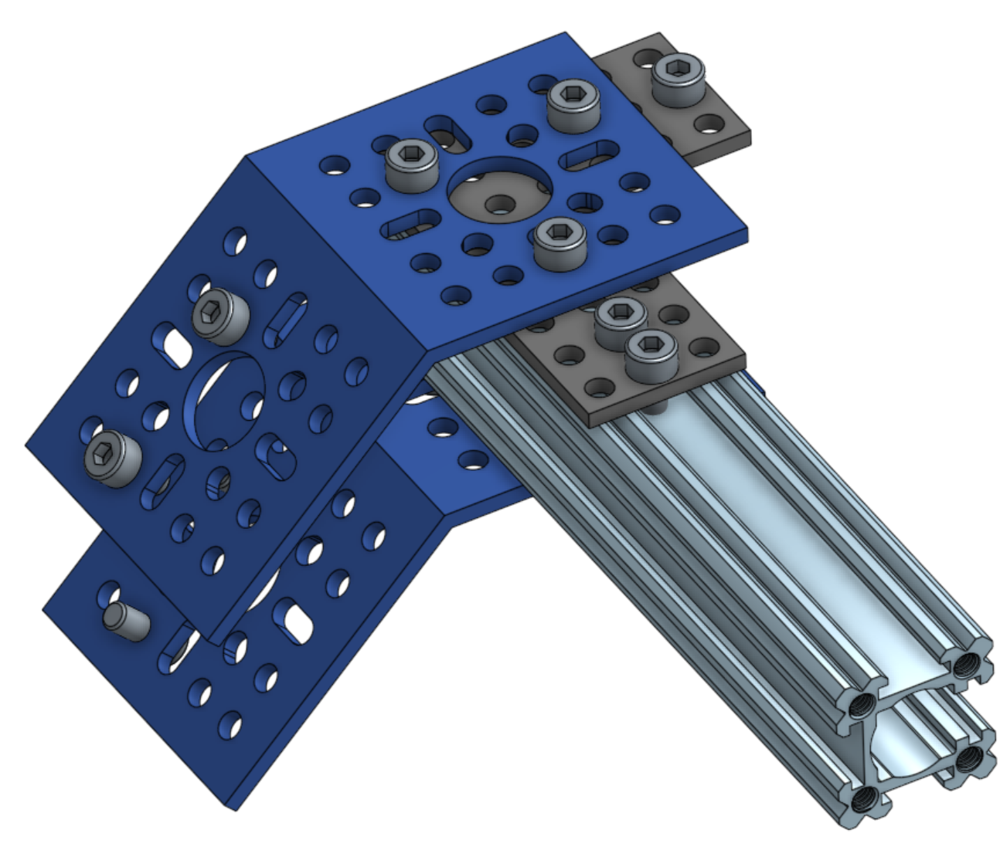

# Rocker-Bogie Suspension

The Rocker-Bogie is the suspension system that enables the rover to climb aggressive obstacles. The design allows all 6 wheels to be in contact with the ground as much as possible, increasing traction.  The suspension system on a typical consumer vehicle can traverse obstacles about half the height of one wheel; the Rocker-Bogie suspension system can traverse obstacles over 2 times the height of the wheel.

## Features

* Modular link lengths give the ability to customize rover geometry
* Optimized for climbing in the forwards direction
* Rigid support structure resists lateral bending/twisting about the Bogie joint

## Mechanical Interface/Attachments to Rover

* Servo block output shafts connect to corner motor assemblies
* rocker-bogie connects to the body axis clamp via two brackets that are detailed in the [integration readme](../../integration/README.md)
* middle drive motor connects to the extruded shaft at the bottom

## Assembly

You will be creating two almost identical assemblies. Below instructions are for one side. We recommend building one side first rather than trying to build both sides in parallel, that way you'll be able to make the other side faster. Before you start building, familiarize yourself with the details of this assembly, in particular because you'll be building two assemblies that are mirrorred. Specifically, you'll want the open slits on the bogie to be facing the same side:

### Creating the rocker-bogie joint

Assemble the joint following the steps below. Since the clamp in the middle isn't symmetric and protrudes on one side, two spacers of different lengths are used. You can see this in the top left image. You'll use spacer `1522-0010-0040` of length 4mm on the side of the clamp that has the protrusion, while on the other, flat side, you'll use spacer `1514-0010-0060` of length 6mm. This creates a tight assembly that prevents the joint from flexing from side to side.

|             |         |
| -------------------------------------- | ----------------------------------- |
|  |  |

Wait with the yellow and orange (ball bearing) parts. The bearing should first be inserted into the yellow hub.

> **Tip**: Use the OnShape model and navigate to the tab 'rocker-bogie' in the bottom to isolate this assembly. Then right click on various parts to temporarily hide them so you can see how the assembly works in 3D.

### Attach the joint bearings to the servo arms

Connect the hub (yellow) with the inserted bearing to the servo arm using 8x socket or button M4 screws of length 12mm (or 10mm). Use washers so that the screw doesn't bury itself in the plastic servo arm and to make sure the screw doesn't extend (much) on the insides of the hubs. When done, the bearing should not be able to fall out. Put these 2 assemblies aside for now. We'll connect each finished joint to the rockers in the following step.

### Attach the extruded shafts

Attach 2x length 96mm aluminum extrusions `1118-0024-0096` to the bogie joint. Pay attention to direction of the slits for the cabling. You'll want the slit to face the top of the rover so you can route the cabling going to the front servo and motor inside of the channel.

### Attach the front servo

First attach bracket `1111-0003-0001` to the extruded shaft you just attached to the joint using three or four M4 screws, routing the wiring for the front servo and front motor from the servo motor through the hole and into the extruded shaft. Then assemble the servo block to the servo motor. Insert the set screw that came with the servo inside the hollow shaft that fits onto the spline profile on the servo output, but don't tighten it yet as we'll have to readjust later when calibrating the corner motors. This screw prevents the corner assembly from falling off the rocker-bogie while driving. Finally, attach the servo motor and block to the front rocker-bogie bracket. The image below shows the resulting assembly. The red line indicates where the wiring should go.

### Connect the servo arms and shaft to the joint

Make sure the slit in the extruded shaft `1118-0024-0096` (same as the other two shafts you already connected to the bogie joint) faces the inside of the rover (you can also point the slit upwards or downwards if you prefer). Route the wiring going to the front servo and motor through it and route the wiring for the middle drive wheel motor through it before you attach the screws. It helps to temporarily keep the wiring in place with some tape as you attach the shaft to the bogie joint.

> **NOTE**: the OnShape model may represent the orientation of the slits incorrectly. In order to make the model nimble, the same rocker-bogie assembly is used on both sides of the rover which has the side-effect that the two assemblies aren't mirrorred like they are supposed to be. Always stop to think about what you're building to avoid having to take things apart later.

Take one of the servo arms with bearing and hub you made in an earlier step amd attach the steel bracket, two hurricane nuts, and 4x socket screws like in the image. Repeat for the other servo arm. If the screws don't slide through the holes in the black servo arm, it might help to drill the holes out a bit.

Place one servo arm assembly over one side of the rocker-bogie joint such that the hurricane nuts fit all the way in the channel. Tighten such that you can still slide the servo arm relative to the channel. Flip the assembly over and repeat on the other side, making sure the setup is symmetric. Now tighten the screws all the way.

### Assemble the back servo

Attach the 1-channel U bracket to the long extruded shaft `11118-0024-0288` using 3 or 4 M4 socket screws of length 10mm. Assemble another servo block as you did before. Insert this into the 1-channel bracket and attach using 6 button M4 screws of length 10mm (6mm or 8mm also works).

### Attach the front and back of the rocker-bogie

Use 4 hurricane nuts and the 45 degree bracket to connect the back and the front of the rocker-bogie using M4 socket screws of length 8mm as in the image below.

Flip the assembly over and attach the two brackets like in the picture below, using 4 more hurricane nuts and socket screws to secure the pieces to the rocker bogie aluminum extrusions. Then route all wires through the aluminum channel that will eventually slide into the rover body. The slit in the channel should orient in the direction where most of the cables enter it (flipped compared to the image below) but either direction works.

|  |
| --- |
| Wiring snugly fits inside the extruded aluminum channels. Only use this image as an idea of how the wiring should be routed, other parts of this image may not reflect the current state of the rocker-bogie at this stage in the process. |

Secure the channel to the rocker-bogie using 5 hurricane nuts (2 at the bottom) and socket screws, making sure the channel end sits flush to the other channels and the wiring isn't squeezed inbetween.

|  |  |
| --- | ---|

Repeat these steps for the other rocker-bogie, making sure it mirrors the first assembly. Once you're done, you're ready with these very important subassemblies!

> **Help improve documentation!** Please make an issue on Github when you spot something that's off or can be improved. Pull requests are even better! If you have a question, post in the #troubleshooting channel in our Slack group.